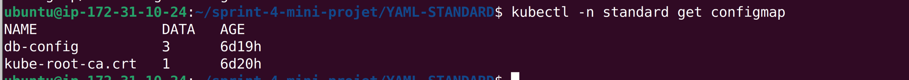

### Déploiement des micro-services avec Kubernetes

L'objectif de ce mini-projet est de **déployer une application FastAPI** sur un cluster **K3s** en respectant les bonnes pratiques Kubernetes. Cela inclut : la configuration de **3 réplicas** pour l’application, le **déploiement de PostgreSQL en StatefulSet** avec une persistance des données via un **PVC**, ainsi que la gestion des **secrets** et **configurations** avec **Secrets** et **ConfigMaps**. Enfin, l’application est exposée à l’extérieur grâce à un **Ingress**.

#### Analyse de l'architecture
Nous devons déployer deux micro-services sur Kubernetes :
1. Une application FastAPI
2. Une base de données PostgreSQL

#### Architecture

L'architecture du déploiement est la suivante :
* **FastAPI** : 3 réplicas, accessible via un sous-domaine personnalisé
* **PostgreSQL** : Base de données avec stockage persistant de 10Gi, déployée en StatefulSet
* **PVC** : Stockage persistant avec accès ReadWriteMany
* **Ingress** : Pour exposer l'application FastAPI à l'extérieur avec un sous-domaine
* **Secrets** : Pour stocker les informations sensibles (mot de passe PostgreSQL)
* **ConfigMap** : Pour stocker les configurations non-sensibles (nom d'utilisateur, nom de base
de données) 

Tous les services sont déployés dans le namespace _standard_.

<p align="center">

</p>
<p align="center">
Figure 1: Architecture de déploiement selon notre besoin   
</p>

#### Les fichiers YAML pour le déploiement standard

1. Préparation de l'environnement
Pour vérifer l'état de K3s:

```#bash
sudo systemctl status k3s
```

<p align="center">

</p>
<p align="center">
Figure 2: Afficher l'état de K3s  
</p>

Pour vérifier les nodes disponibles
```#Bash
kubectl get nodes
```
<p align="center">

</p>
<p align="center">
Figure 3: Vérifier les noeuds dans le namespace default  
</p>

Pour vérifier que nous avons accès au cluster
```#Bash
kubectl cluster-info
``` 

<p align="center">

</p>
<p align="center">
Figure 4: Vérifier les informations du cluster  
</p>

2. Construction de l'image Docker pour FastAPI

Nous commençons par cloner le dépôt distant en utilisant la commande suivante :

```
git clone https://github.com/votre-repo/kubernetes-devops-project.git
```
Pour construire l'image Docker : 

```#Bash
cd kubernetes-devops-project
docker build -t fastapi-app:latest .
```

<p align="center">

</p>
<p align="center">
Figure 5: Vérifier les informations du cluster  
</p>

Pour vérifier que l'image est créée

```#Bash
docker images | grep fastapi-app
```

<p align="center">

</p>
<p align="center">
Figure 6: Vérifier que l'image docker a bien été construite  
</p>

3. Déploiement des ressources Kubernetes


Pour créer le namespace ‘standard’

```#Bash
kubectl apply -f namespace.yaml
```

Pour voir si le namespace ‘standard’ est bien créé :

<p align="center">

</p>
<p align="center">
Figure 7: Vérifier que le namespace standard a bien été créé  
</p>

Pour déployer les ressources de configuration :

Voir le contenu du fichier _configmap.yaml_ dans le repo.

```#Bash
kubectl apply -f configmap.yaml
```

Pour vérifier le configmap:

<p align="center">

</p>
<p align="center">
Figure 8: Vérifier que le namespace standard a bien été créé  
</p>


Voir le contenu du fichier _secret_.yaml_ dans le repo.

```#Bach
kubectl apply -f secret.yaml
```

Pour vérifier le secret :

<p align="center">

</p>
<p align="center">
Figure 8: Vérifier que le namespace standard a bien été créé  
</p>

Pour déployer le PVC pour le stockage

```#Bash
kubectl apply -f pvc.yaml
```

Pour vérifier le pvc 

```#Bash
kubectl -n standard get pvc
```

<p align="center">

</p>
<p align="center">
</p>


Pour déployer la base de données

```#Bash
kubectl apply -f postgres-statefulset.yaml
```

Pour vérifier le service statefulset :


<p align="center">

</p>
<p align="center">
</p>
 
Pour créer le service ClusterIP

```#Bash
kubectl apply -f postgres-service.yaml
```
Pour créer le service ClusterIP

```#Bash
kubectl -n standard get service
```
<p align="center">

</p>
<p align="center">
</p>

Pour déployer l'application FastAPI, nous devons choisir une solution afin que l’image soit accessible au cluster K3s. Cela est dû au fait que notre image a été construite avec Docker et que, par conséquent, K3s ne la voit pas.

Une alternative consiste à récupérer l’image depuis un registre Docker. 

L’autre solution est de transférer l’image Docker directement vers le cluster K3s. Nous choisissons cette deuxième solution et utilisons donc la commande _ctr_ pour le faire :

```#Bash
docker save fastapi-app:latest -o fastapi-app.tar 
k3s ctr images import fastapi-app.tar 
```

<p align="center">

</p>
<p align="center">
</p>

Puis, nous vérifions si elle est bien enregistrée :

```#Bash
k3s crictl images | grep fastapi-app
``` 

<p align="center">

</p>
<p align="center">
</p>

En suite, nous créons notre deployment :

```#Bash
kubectl apply -f fastapi-deployment.yaml
```

Pour vérifier le service deployment :

```#Bash
kubectl -n standard get deployment.yaml
``` 

<p align="center">

</p>
<p align="center">
</p>

Pour déployer le service ClusterIP :

```#Bash
kubectl apply -f fastapi-service.yaml
```
<p align="center">

</p>
<p align="center">
</p>

Pour déployer l'Ingress, nous devons definir un sous-domain _app1.afa.ip-ddns.com_ dans la plateforme _https://cloudns.net_. Les étapes sont définis dans la section 5.

```#Bash
kubectl apply -f ingress.yaml
```

Pour vérifier le service Ingress

<p align="center">

</p>
<p align="center">
</p>


4. Vérification du déploiement

Nous vérifions tous les pods dans le namespace standard

```#Bash
kubectl -n standard get pods 
``` 

<p align="center">

</p>
<p align="center">
</p>


Pour vérifier les services
```#Bash
kubectl -n standard get services 
```

<p align="center">

</p>
<p align="center">
</p>


Pour vérifier les logs de l'application FastAPI

```#Bash
kubectl -n standard logs -l app=fastapi 
```

<p align="center">

</p>
<p align="center">
</p>

Pour vérifier les logs de PostgreSQL

```#Bash
kubectl -n standard logs -l app=postgres 
```

<p align="center">

</p>
<p align="center">
</p>

#### 5. Configuration du DNS
    1. Créer un compte sur https://cloudns.net.
    2. Créer un sous-domaine : app1.afa.ip-ddns.com.
    3. Ajouter un enregistrement A pointant vers l'adresse IP publique de notre VM. 
#### 6. Test de l'application
    1. Accéder à l'application via http://app1.afa.ip-ddns.com 
    2. nous affichons le swagger en testant la route /docs en tapant l’url: app1.afa.ip-ddns.com/docs   


    3. Tester l’API pour créer un utilisateur :
 
       
    4. Vérifier la route /users pour voir la liste des utilisateurs 
       

    5. Vérifier la route /users/count pour obtenir le nombre total d'utilisateurs 
       
#### 7. Sauvegarde de la base de données ETCD

Un cluster K3s en mode single node utilise par défaut une base de données SQLite
nous pouvons sauvegarder cette base de données en exécutant la commande suivante : 
sudo cp /var/lib/rancher/k3s/server/db/state.db ./k3s-snapshot-$(date +%Y%m%d).db

 
